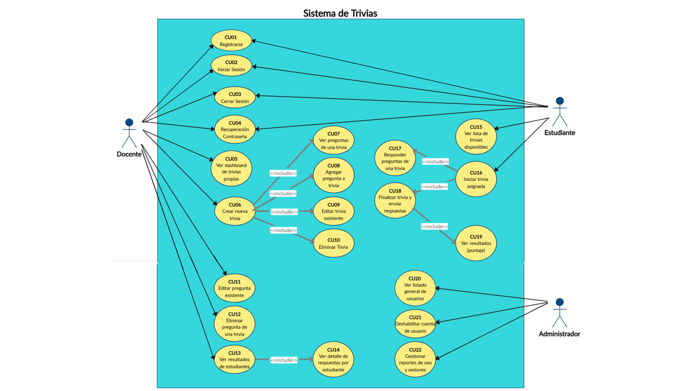
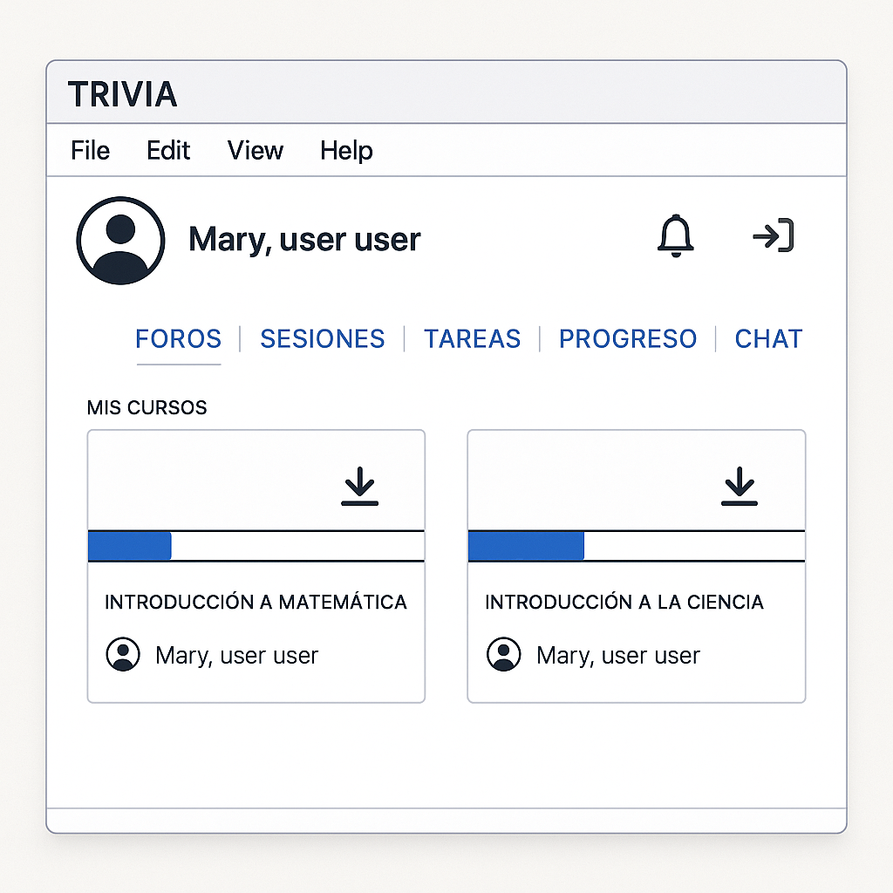
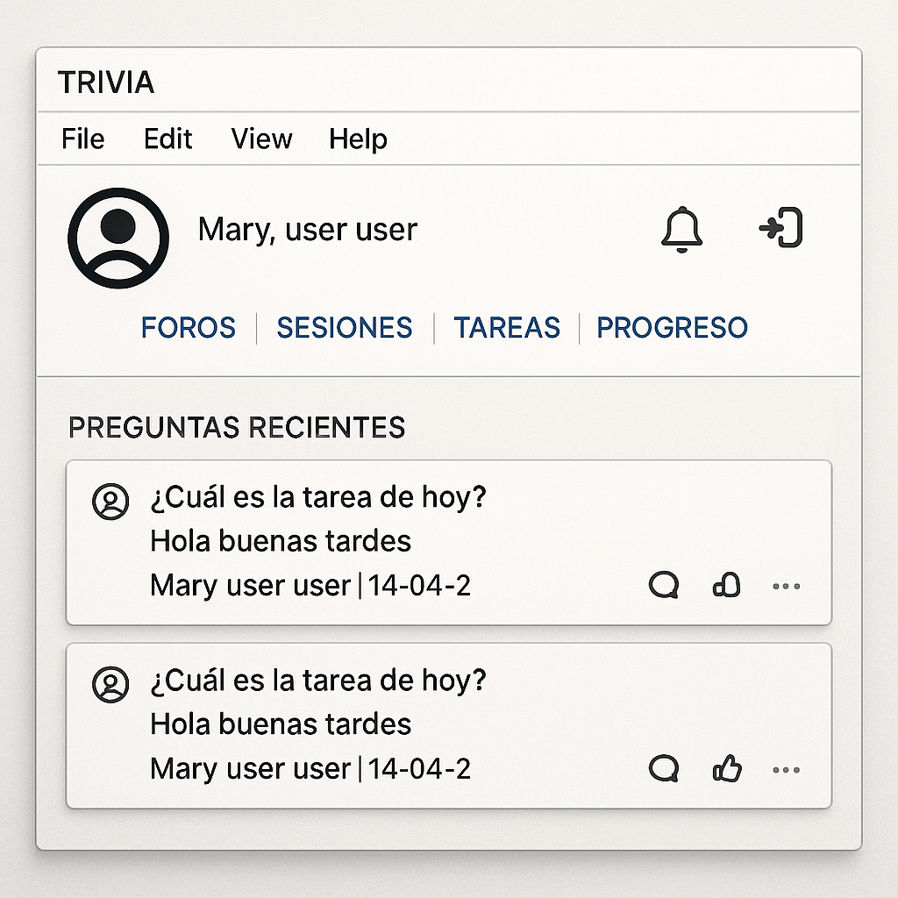
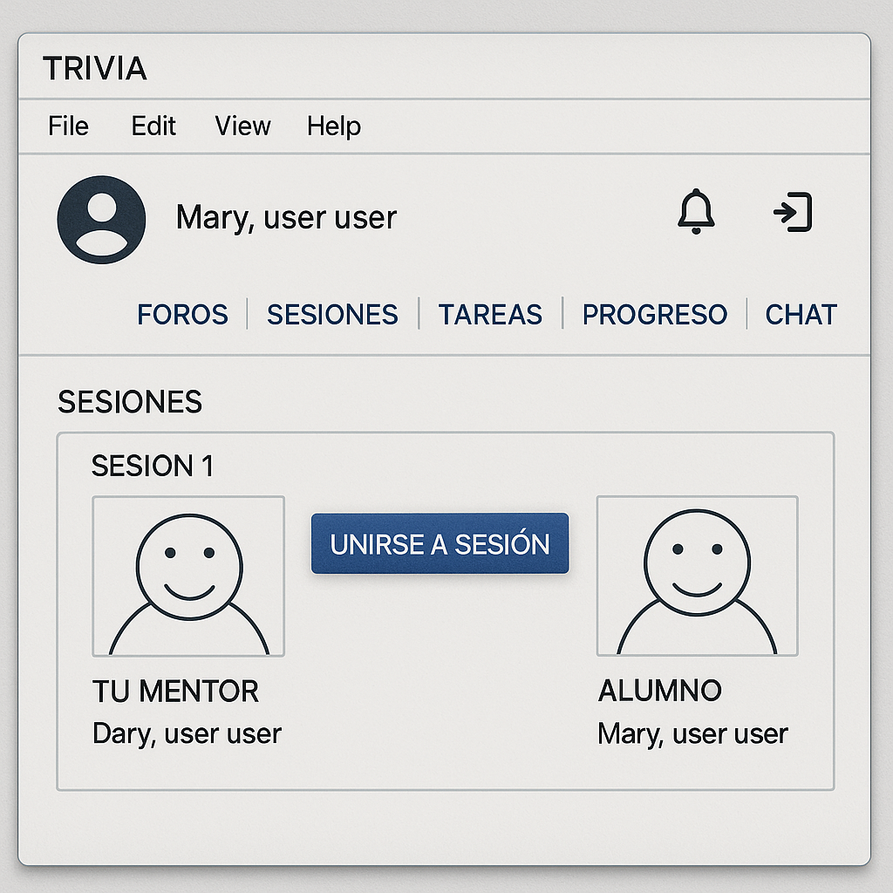
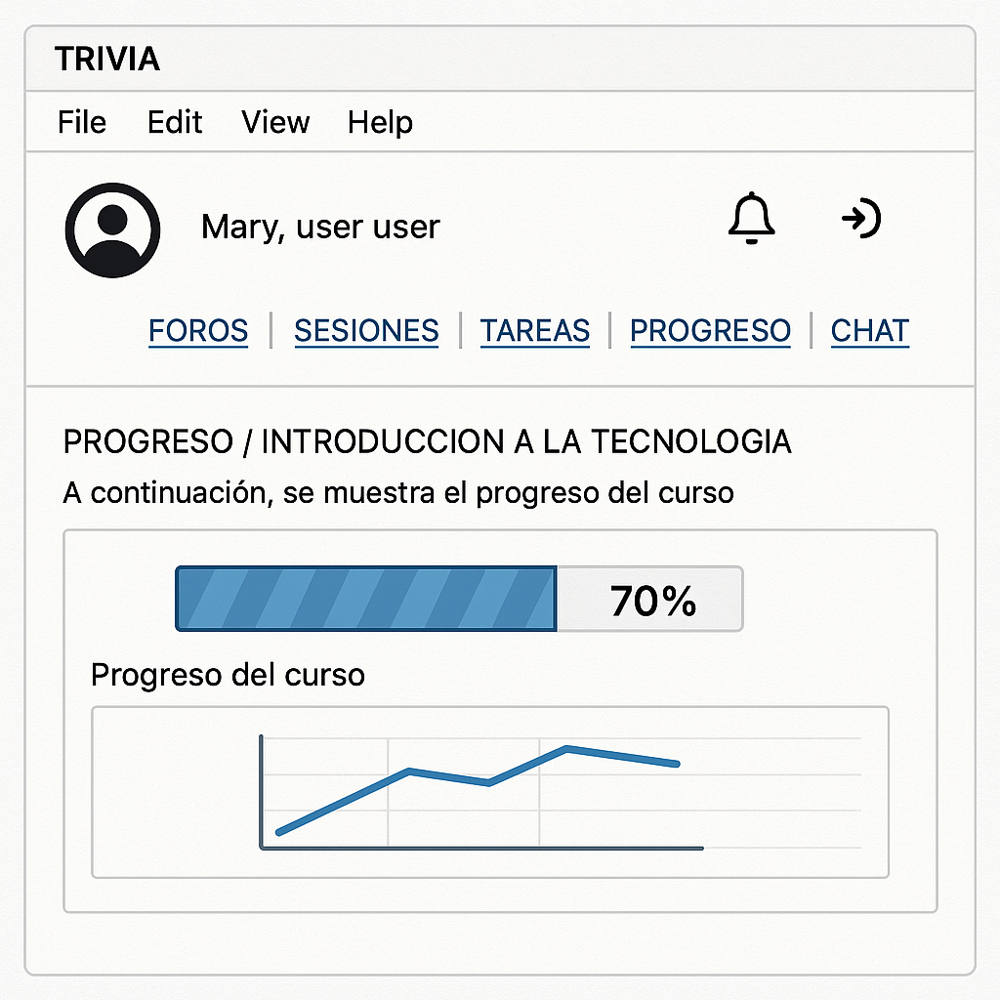
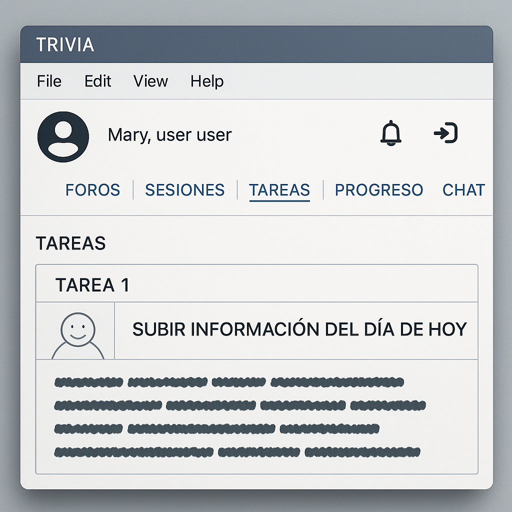

# 📘 Documentación del Desarrollador  
## Proyecto: IMPLEMENTACIÓN DE UNA HERRAMIENTA INTERACTIVA PARA FOMENTAR LA PARTICIPACIÓN ESTUDIANTIL

---

## 📋 Índice

- [1. Introducción](#1-introducción)
- [2. Requisitos del sistema](#2-requisitos-del-sistema)
  - [2.1 Requisitos funcionales](#21-requisitos-funcionales)
  - [2.2 Requisitos no funcionales](#22-requisitos-no-funcionales)
- [3. Análisis](#3-análisis)
  - [3.1 Casos de uso](#31-casos-de-uso)
  - [3.2 Diagrama de casos de uso](#32-diagrama-de-casos-de-uso)
  - [3.3 Modelo BPMN](#33-modelo-bpmn)
- [4. Diseño del sistema](#4-diseño-del-sistema)
  - [4.1 Prototipos UX/UI](#41-prototipos-uxui)
  - [4.2 Modelo entidad-relación](#42-modelo-entidad-relación)
  - [4.3 Modelo de base de datos lógico y físico](#43-modelo-de-base-de-datos-lógico-y-físico)
  - [4.4 Diagrama de clases (opcional)](#44-diagrama-de-clases-opcional)
- [5. Base de datos](#5-base-de-datos)
  - [5.1 Código SQL de creación](#51-código-sql-de-creación)
  - [5.2 Scripts adicionales (triggers, views, procedures)](#52-scripts-adicionales-triggers-views-procedures)
- [6. Desarrollo](#6-desarrollo)
  - [6.1 Estructura del proyecto](#61-estructura-del-proyecto)
  - [6.2 Tecnologías utilizadas](#62-tecnologías-utilizadas)
  - [6.3 Configuraciones importantes](#63-configuraciones-importantes)
- [7. Entregables y archivos adjuntos](#7-entregables-y-archivos-adjuntos)
- [8. Conclusiones y recomendaciones](#8-conclusiones-y-recomendaciones)

---

## 1. Introducción

Este documento corresponde al primer avance del proyecto titulado **"Implementación de una herramienta interactiva para fomentar la participación estudiantil en Crack The Code"**, desarrollado para la startup educativa Crack The Code, especializada en la formación tecnológica para jóvenes en Latinoamérica.

El objetivo principal del proyecto es desarrollar una plataforma tecnológica innovadora que incremente la participación activa de los estudiantes a través de dinámicas interactivas, gamificación y retroalimentación personalizada. Esta herramienta busca complementar los cursos y bootcamps existentes, mejorando la experiencia educativa y manteniendo la motivación y el compromiso de los alumnos durante todo el proceso de aprendizaje.

Actualmente, la empresa enfrenta desafíos relacionados con la falta de herramientas interactivas dentro de su plataforma Moodle, lo que limita la capacidad de mantener el interés y la retención de los estudiantes. La solución propuesta se enfoca en incorporar funcionalidades que permitan la autoevaluación, seguimiento del progreso y comunicación fluida entre estudiantes y docentes, generando un ambiente educativo dinámico y atractivo.

Este documento recopila la planificación, análisis de requerimientos, diseño y avances realizados, con el propósito de guiar al equipo de desarrollo en la implementación efectiva de la solución tecnológica, garantizando su alineación con los objetivos estratégicos de Crack The Code y las necesidades de sus usuarios finales.


---

## 2. Requisitos del sistema

### 2.1 Requisitos funcionales
#### 📦 RF1: Registro y Autenticación de Usuarios
<details>
  <summary>Ver requisitos</summary>

- RF1.1: El sistema debe permitir el registro de usuarios (docentes y estudiantes) con una dirección de email válida y una contraseña de mínimo 8 caracteres.
- RF1.2: El sistema debe permitir a los usuarios iniciar sesión con email y contraseña registrados.
- RF1.3: El sistema debe permitir la recuperación de contraseña mediante envío de enlace de restablecimiento al correo electrónico del usuario.

</details>

#### 🎯 RF2: Gestión de Trivias (Docente)
<details>
  <summary>Ver requisitos</summary>

- RF2.1: El sistema debe permitir al docente crear una trivia ingresando un título (mínimo 5 caracteres) y una descripción (opcional).
- RF2.2: El sistema debe permitir listar todas las trivias creadas por el docente actual, mostrando al menos título, número de preguntas y fecha de creación.
- RF2.3: El sistema debe permitir editar el título y descripción de una trivia existente.
- RF2.4: El sistema debe permitir eliminar trivias creadas por el docente actual.

</details>

#### 📊 RF3: Gestión de Preguntas (Docente)
<details>
  <summary>Ver requisitos</summary>

- RF3.1: El sistema debe permitir al docente agregar preguntas de opción múltiple a una trivia, especificando el enunciado, al menos 2 opciones, y una opción correcta.
- RF3.2: El sistema debe permitir al docente agregar preguntas de tipo verdadero/falso.
- RF3.3: El sistema debe permitir al docente editar el enunciado, las opciones y la respuesta correcta de una pregunta existente.
- RF3.4: El sistema debe permitir eliminar preguntas de una trivia.

</details>

#### 🧮 RF4: Interacción del Estudiante
<details>
  <summary>Ver requisitos</summary>

- RF4.1: El sistema debe permitir a un estudiante registrado ver la lista de trivias disponibles para su cuenta, incluyendo título y estado (completada/no completada).
- RF4.2: El sistema debe permitir que un estudiante seleccione una trivia y responda todas las preguntas en una sola sesión.
- RF4.3: El sistema debe almacenar el intento del estudiante, incluyendo sus respuestas, la trivia respondida y la fecha del intento.

</details>

#### 🛠️ RF5: Visualización de Resultados
<details>
  <summary>Ver requisitos</summary>

- RF5.1: Al finalizar una trivia, el sistema debe mostrar al estudiante un resumen con su puntaje total (porcentaje de aciertos), número de respuestas correctas/incorrectas y las respuestas correctas de cada pregunta.
- RF5.2: El sistema debe permitir al docente consultar un historial de intentos de cada trivia, filtrando por estudiante y fecha, mostrando para cada intento: nombre del estudiante, fecha del intento y puntaje obtenido.

</details>

### 2.2 Requisitos no funcionales
#### 📦 RNF1: Seguridad
<details>
  <summary>Ver requisitos</summary>

- RNF1.1: Las contraseñas de todos los usuarios deben almacenarse cifradas con el algoritmo BCrypt.
- RNF1.2: El sistema debe implementar protección contra ataques comunes: CSRF, XSS y SQL Injection (verificable mediante pruebas de penetración).
- RNF1.3: Solo los usuarios autenticados pueden acceder a funcionalidades privadas del sistema (verificable mediante pruebas de roles).

</details>

#### 🎯 RNF2: Rendimiento
<details>
  <summary>Ver requisitos</summary>

- RNF2.1: El sistema debe ser capaz de manejar al menos 100 usuarios activos simultáneamente sin pérdida de funcionalidad.
- RNF2.2: El tiempo de carga de una trivia (preguntas + opciones) no debe superar los 2 segundos bajo carga normal (medido con herramientas de pruebas de rendimiento como JMeter o Apache Benchmark).

</details>

#### 📊 RNF3: Usabilidad
<details>
  <summary>Ver requisitos</summary>

- RNF3.1: La interfaz del sistema debe permitir a un usuario nuevo completar el registro y responder una trivia en menos de 5 minutos sin ayuda externa (verificable mediante pruebas de usabilidad).
- RNF3.2: El sistema debe ser accesible desde dispositivos móviles y de escritorio, utilizando diseño responsive (verificable con herramientas como Chrome DevTools)

</details>

#### 🧮 RNF4: Disponibilidad
<details>
  <summary>Ver requisitos</summary>

- RNF4.1: El sistema debe estar disponible al menos el 99% del tiempo mensual (medido por el proveedor de hosting, como Render).
- RNF4.2: El sistema debe mostrar un mensaje de error amigable en caso de fallas de conexión o errores del servidor.

</details>


## 3. Análisis

### 3.1 Casos de uso
<details>
  <summary>Ver casos</summary>

#### Módulo 1 : Autenticación Y Gestión De Usuarios  
**Objetivo:** Permitir el acceso seguro al sistema y la gestión básica de cuentas.

- **CU01 – Registrarse**  
  - **Actor Principal:** Docente / Estudiante / Administrador  
  - **Precondiciones:** El usuario no debe estar registrado.  
  - **Flujo Principal:**  
    1. Accede al formulario de registro.  
    2. Ingresa nombre, correo, contraseña y rol.  
    3. El sistema valida que el correo no esté registrado.  
    4. El sistema cifra la contraseña (BCrypt) y registra al usuario.  
    5. Se redirige al login.  
  - **Flujos Alternativos:**  
    3a. Si el correo ya existe, se muestra un mensaje de error.  
  - **Postcondiciones:** La cuenta se crea y el usuario puede iniciar sesión.

- **CU02 – Iniciar sesión**  
  - **Actor Principal:** Todos los usuarios  
  - **Precondiciones:** El usuario debe estar registrado.  
  - **Flujo Principal:**  
    1. Accede al login.  
    2. Ingresa correo y contraseña.  
    3. El sistema valida credenciales y redirige según el rol.  
  - **Flujos Alternativos:**  
    3a. Si las credenciales no coinciden, muestra error.  
  - **Postcondiciones:** Acceso concedido al sistema.

- **CU03 – Cerrar sesión**  
  - **Actor Principal:** Todos los usuarios  
  - **Precondiciones:** Usuario autenticado.  
  - **Flujo Principal:**  
    1. Clic en “Cerrar sesión”.  
    2. El sistema invalida la sesión.  
    3. Redirige al login.  
  - **Postcondiciones:** Sesión cerrada correctamente.

- **CU04 – Recuperar contraseña**  
  - **Actor Principal:** Todos los usuarios  
  - **Precondiciones:** Correo registrado.  
  - **Flujo Principal:**  
    1. Accede a "¿Olvidaste tu contraseña?".  
    2. Ingresa su correo.  
    3. El sistema envía enlace de recuperación.  
    4. Define una nueva contraseña.  
  - **Flujos Alternativos:**  
    2a. Si el correo no está registrado, se muestra error.  
  - **Postcondiciones:** Contraseña actualizada.

---

#### Módulo 2 : Gestión de Trivias (Docente)  
**Objetivo:** Permitir al docente crear, administrar y editar trivias educativas.

- **CU05 – Ver Dashboard de trivias propias**  
  - **Actor Principal:** Docente  
  - **Precondiciones:** Autenticado como docente.  
  - **Flujo Principal:**  
    1. Accede al panel de trivias.  
    2. El sistema muestra sus trivias activas.  
  - **Flujos Alternativos:**  
    Si no hay trivias, se muestra un mensaje vacío.  
  - **Postcondiciones:** Trivias listadas en el panel.

- **CU06 – Crear nueva trivia**  
  - **Actor Principal:** Docente  
  - **Precondiciones:** Sesión activa.  
  - **Flujo Principal:**  
    1. Accede a “Crear trivia”.  
    2. Llena título, descripción y tiempo.  
    3. El sistema guarda la trivia.  
  - **Flujos Alternativos:**  
    Si falta un campo obligatorio, muestra error.  
  - **Postcondiciones:** Trivia registrada.

- **CU07 – Ver listado de preguntas de una trivia**  
  - **Actor Principal:** Docente  
  - **Precondiciones:** Trivia existente.  
  - **Flujo Principal:**  
    1. Entra al detalle de la trivia.  
    2. Se listan las preguntas asociadas.  
  - **Postcondiciones:** Visualiza las preguntas de esa trivia.

- **CU08 – Agregar pregunta a trivia**  
  - **Actor Principal:** Docente  
  - **Precondiciones:** Trivia existente.  
  - **Flujo Principal:**  
    1. Clic en “Agregar pregunta”.  
    2. Define tipo, enunciado, opciones, respuesta correcta.  
    3. El sistema guarda la pregunta.  
  - **Flujos Alternativos:**  
    Si no hay respuesta marcada, muestra advertencia.  
  - **Postcondiciones:** Pregunta añadida.

- **CU09 – Editar trivia existente**  
  - **Actor Principal:** Docente  
  - **Precondiciones:** Trivia creada por el docente.  
  - **Flujo Principal:**  
    1. Accede a trivia.  
    2. Modifica campos.  
    3. Guarda cambios.  
  - **Postcondiciones:** Trivia actualizada.

- **CU10 – Eliminar trivia**  
  - **Actor Principal:** Docente  
  - **Precondiciones:** Ser propietario de la trivia.  
  - **Flujo Principal:**  
    1. Clic en “Eliminar trivia”.  
    2. Confirma la acción.  
    3. El sistema borra la trivia y preguntas asociadas.  
  - **Postcondiciones:** Trivia eliminada.

- **CU11 – Editar pregunta existente**  
  - **Actor Principal:** Docente  
  - **Precondiciones:** Pregunta ya registrada.  
  - **Flujo Principal:**  
    1. Accede a la pregunta.  
    2. Edita el enunciado, tipo u opciones.  
    3. Guarda cambios.  
  - **Postcondiciones:** Pregunta modificada.

- **CU12 – Eliminar pregunta**  
  - **Actor Principal:** Docente  
  - **Precondiciones:** Pregunta existente.  
  - **Flujo Principal:**  
    1. Elige la pregunta.  
    2. Confirma eliminación.  
    3. El sistema la elimina.  
  - **Postcondiciones:** Pregunta removida.

---

#### Módulo 3 : Evaluación y Resultados (Docente)  
**Objetivo:** Brindar herramientas al docente para el seguimiento del desempeño estudiantil.

- **CU13 – Ver resultados de los estudiantes**  
  - **Actor Principal:** Docente  
  - **Precondiciones:** Estudiantes han respondido a la trivia.  
  - **Flujo Principal:**  
    1. Accede a “Ver resultados”.  
    2. El sistema muestra lista con nombres, puntajes, fechas.  
  - **Postcondiciones:** Resultados visibles.

- **CU14 – Ver detalle de respuestas por estudiante**  
  - **Actor Principal:** Docente  
  - **Precondiciones:** Al menos un intento registrado.  
  - **Flujo Principal:**  
    1. Selecciona a un estudiante.  
    2. Se muestran sus respuestas por pregunta.  
  - **Postcondiciones:** Docente accede a análisis individual.

---

#### Módulo 4 : Participación Estudiantil  
**Objetivo:** Facilitar a los estudiantes el acceso y resolución de trivias asignadas.

- **CU15 – Ver lista de trivias disponibles**  
  - **Actor Principal:** Estudiante  
  - **Precondiciones:** Sesión activa.  
  - **Flujo Principal:**  
    1. Accede a la sección “Mis trivias”.  
    2. Se muestran trivias habilitadas.  
  - **Postcondiciones:** Estudiante conoce sus trivias pendientes.

- **CU16 – Iniciar trivia asignada**  
  - **Actor Principal:** Estudiante  
  - **Precondiciones:** Trivia disponible y no respondida.  
  - **Flujo Principal:**  
    1. Selecciona trivia.  
    2. Se muestra introducción o instrucciones.  
    3. Inicia la trivia.  
  - **Postcondiciones:** Sesión de trivia en progreso.

- **CU17 – Responder preguntas de trivia**  
  - **Actor Principal:** Estudiante  
  - **Precondiciones:** Trivia iniciada.  
  - **Flujo Principal:**  
    1. Lee pregunta.  
    2. Selecciona respuesta.  
    3. Clic en siguiente.  
  - **Flujos Alternativos:**  
    Si no responde, sistema no deja avanzar.  
  - **Postcondiciones:** Respuestas guardadas temporalmente.

- **CU18 – Finalizar trivia y enviar respuestas**  
  - **Actor Principal:** Estudiante  
  - **Precondiciones:** Trivia en progreso.  
  - **Flujo Principal:**  
    1. Clic en “Finalizar trivia”.  
    2. El sistema registra intento, puntaje y tiempo.  
  - **Postcondiciones:** Trivia finalizada.

- **CU19 – Ver resultados (puntaje y feedback)**  
  - **Actor Principal:** Estudiante  
  - **Precondiciones:** Trivia finalizada.  
  - **Flujo Principal:**  
    1. El sistema muestra resultados automáticamente.  
    2. Se ve puntaje, preguntas correctas e incorrectas.  
  - **Postcondiciones:** Feedback completo al estudiante.

---

#### Módulo 5 : Administración y Monitoreo del Sistema  
**Objetivo:** Supervisar la actividad del sistema, usuarios y métricas clave.

- **CU20 – Ver listado general de usuarios**  
  - **Actor Principal:** Administrador  
  - **Precondiciones:** Acceso administrativo.  
  - **Flujo Principal:**  
    1. Accede al módulo de usuarios.  
    2. Se muestra lista completa con datos y rol.  
  - **Postcondiciones:** Lista visible para gestión.

- **CU21 – Deshabilitar cuenta de usuario**  
  - **Actor Principal:** Administrador  
  - **Precondiciones:** Usuario seleccionado.  
  - **Flujo Principal:**  
    1. Clic en deshabilitar.  
    2. Confirma la acción.  
    3. El sistema cambia el estado a “inactivo”.  
  - **Postcondiciones:** Usuario bloqueado.

- **CU22 – Gestionar reportes y sesiones**  
  - **Actor Principal:** Administrador  
  - **Precondiciones:** Acceso al panel de reportes.  
  - **Flujo Principal:**  
    1. Accede a “Reportes”.  
    2. Filtra por fechas, rol u otra variable.  
    3. Visualiza gráficos y estadísticas.  
    4. Exporta si lo desea.  
  - **Postcondiciones:** Informes generados para análisis.

</details>


### 3.2 Diagrama de casos de uso  

<details>
  <summary>Ver Diagrama</summary>
 


 </details>

### 3.3 Modelo BPMN  
📎 Adjuntar imagen:  


---

## 4. Diseño del sistema

### 4.1 Prototipos UX/UI  

 <details>
  <summary>Ver Prototipos</summary>

#### Pantalla 1: Pantalla Principal del Usuario: Acceso a Foros, Sesiones, Tareas y Progreso
- 
#### Pantalla 2: Pantalla de Foros: Interacción Asincrónica con Docentes y Pares
- 
#### Pantalla 3: Pantalla de Mentoría Virtual: Sesiones Uno a Uno con Mentores
- 
#### Pantalla 4: Pantalla de Progreso Personalizado del Estudiante
- 
#### Pantalla 5: Pantalla de Entrega de Tareas y Feedback Escrito
- 

  </details>

### 4.2 Modelo entidad-relación  

<details>
  <summary>Ver Diagrama</summary>


 </details>

### 4.3 Modelo de base de datos lógico y físico  

<details>
  <summary>Ver Modelos</summary>

- [📄 Modelo lógico](./imagenes/modeloLogico.png)  
- [📄 Modelo físico](./imagenes/modeloFisico.png)

</details>


## 5. Base de datos

### 5.1 Código SQL de creación  

<details>
  <summary>Ver Codigo SQL</summary>

```sql
-- Tabla general usuarios
CREATE TABLE usuarios (
    id BIGINT AUTO_INCREMENT PRIMARY KEY,
    nombre VARCHAR(45) NOT NULL,
    email VARCHAR(45) NOT NULL UNIQUE,
    contraseña VARCHAR(255) NOT NULL, -- almacenar hash seguro
    rol ENUM('estudiante', 'docente', 'administrador') NOT NULL,
    estado ENUM('activo', 'inactivo') NOT NULL DEFAULT 'activo',
    fecha_creacion TIMESTAMP DEFAULT CURRENT_TIMESTAMP
);

-- Tabla estudiantes (subtipo de usuarios)
CREATE TABLE estudiantes (
    id BIGINT PRIMARY KEY,
    matricula VARCHAR(20) UNIQUE,
    programa_estudio VARCHAR(100),
    semestre INT,
    FOREIGN KEY (id) REFERENCES usuarios(id) ON DELETE CASCADE
);

-- Tabla docentes (subtipo de usuarios)
CREATE TABLE docentes (
    id BIGINT PRIMARY KEY,
    codigo_docente VARCHAR(20) UNIQUE,
    departamento VARCHAR(100),
    titulo_academico VARCHAR(100),
    FOREIGN KEY (id) REFERENCES usuarios(id) ON DELETE CASCADE
);

-- Tabla administradores (subtipo de usuarios)
CREATE TABLE administradores (
    id BIGINT PRIMARY KEY,
    nivel_acceso VARCHAR(50),
    descripcion TEXT,
    FOREIGN KEY (id) REFERENCES usuarios(id) ON DELETE CASCADE
);

-- Tabla trivias
CREATE TABLE trivias (
    id BIGINT AUTO_INCREMENT PRIMARY KEY,
    titulo VARCHAR(45) NOT NULL,
    descripcion TEXT,
    fecha_creacion DATE NOT NULL,
    tiempo_limite INT NOT NULL,
    docente_id BIGINT NOT NULL,
    FOREIGN KEY (docente_id) REFERENCES docentes(id) ON DELETE CASCADE
);

-- Tabla preguntas
CREATE TABLE preguntas (
    id BIGINT AUTO_INCREMENT PRIMARY KEY,
    enunciado TEXT NOT NULL,
    tipo ENUM('opcion_multiple', 'verdadero_falso', 'respuesta_corta') NOT NULL,
    opciones JSON,
    respuesta_correcta TEXT NOT NULL,
    trivia_id BIGINT NOT NULL,
    FOREIGN KEY (trivia_id) REFERENCES trivias(id) ON DELETE CASCADE
);

-- Tabla intentos
CREATE TABLE intentos (
    id BIGINT AUTO_INCREMENT PRIMARY KEY,
    fecha DATETIME NOT NULL DEFAULT CURRENT_TIMESTAMP,
    puntaje DECIMAL(5,2),
    estudiante_id BIGINT NOT NULL,
    trivia_id BIGINT NOT NULL,
    FOREIGN KEY (estudiante_id) REFERENCES estudiantes(id) ON DELETE CASCADE,
    FOREIGN KEY (trivia_id) REFERENCES trivias(id) ON DELETE CASCADE
);

-- Tabla respuestas_estudiantes
CREATE TABLE respuestas_estudiantes (
    id BIGINT AUTO_INCREMENT PRIMARY KEY,
    respuesta TEXT NOT NULL,
    es_correcta BOOLEAN NOT NULL,
    intento_id BIGINT NOT NULL,
    pregunta_id BIGINT NOT NULL,
    FOREIGN KEY (intento_id) REFERENCES intentos(id) ON DELETE CASCADE,
    FOREIGN KEY (pregunta_id) REFERENCES preguntas(id) ON DELETE CASCADE
);

</details>
